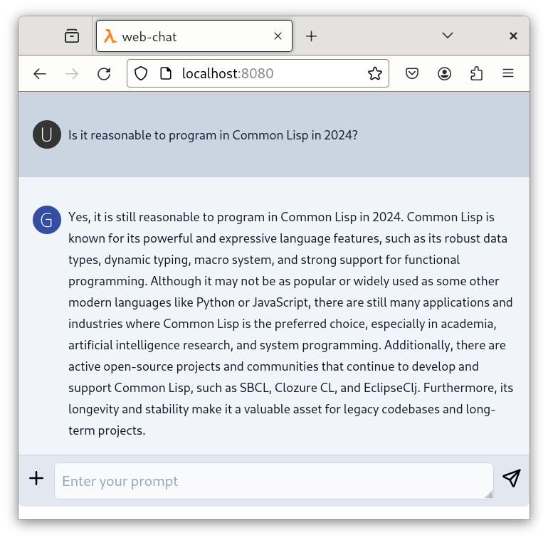

# cl-chat
> A Common Lisp LLM chat library

Usage
------

`cl-chat` is available via [ocicl](https://github.com/ocicl/ocicl).  Install it like so:
```
$ ocicl install chat
```
The `chat` package is comically small; containing just one class definition and one method.  It simply maintains conversation state for `completions`-based conversations.

In its simplest form, use:
```common lisp
(let ((c (make-instance 'chat)))
  (say c "Tell me a joke"))
```

The default chat LLM is OpenAI, and requires that the `OPENAI_API_KEY`
environment variable be set.  However, you can also create chats using any LLM supported by
the [completions](https://github.com/atgreen/cl-completions) package.  For instance:

```common lisp
(let ((c (make-instance 'chat :completer (make-instance 'completions:ollama-completer
                                                        :model "mistral:latest"))))
  (say c "Tell me a joke"))
```

This repo also includes a web-chat interface.  Run it like so:
```
$ sbcl --eval "(asdf:load-system :web-chat)" --eval "(web-chat:start-server)"
```



Related Projects
-----------------

Related projects include:
* [cl-completions](https://github.com/atgreen/cl-completions) an LLM completions library
* [cl-embeddings](https://github.com/atgreen/cl-embeddings) an LLM embeddings library
* [cl-chroma](https://github.com/atgreen/cl-chroma) for a Lisp interface to the [Chroma](https://www.trychroma.com/) vector database.

Author and License
-------------------

``cl-chat`` was written by [Anthony
Green](https://github.com/atgreen) and is distributed under the terms
of the MIT license.
